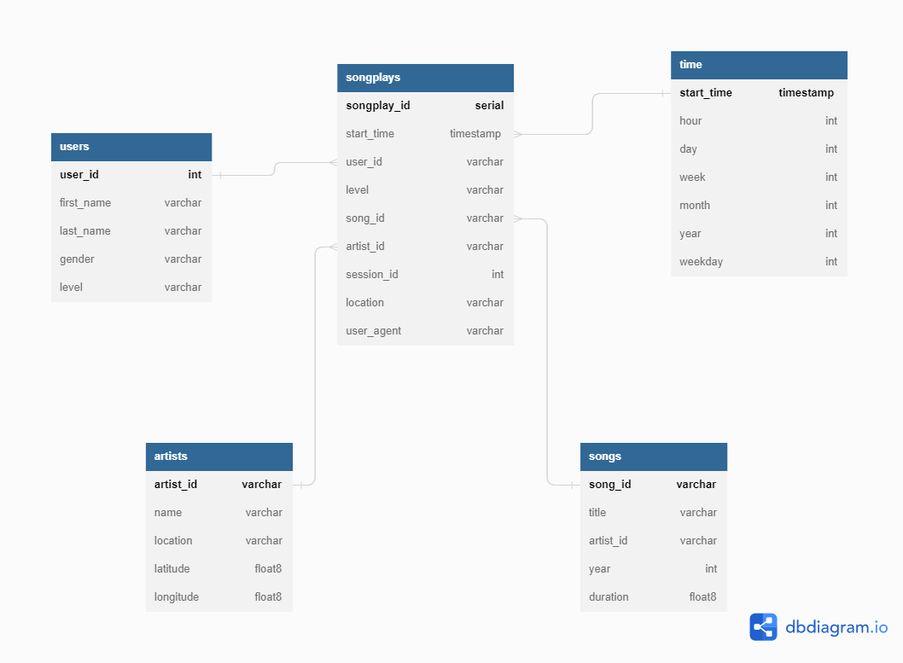

**Author:** Judith Gil Maroto

**Project GitHub Repo:** https://github.com/judithgm/Project1-PostgreSQL-Udacity

### Introduction  - Purpose of the project and the analytical goals.

A startup called Sparkify wants to analyze the data they've been collecting on songs and user activity on their new music streaming app. The analytics team is particularly interested in understanding what songs users are listening to. 

They'd like a data engineer to create a Postgres database with tables designed to optimize queries on song play analysis

**The aim of the project is to design the database schema, separate the different processes into modules programmed in different scripts, which helps to interpret the code more easily and finally obtain a robust and automated ETL process for the insertion and management of records in the different tables of the database**

### Files - Data & scripts

#### DATA

- **"data" folder :** *data/*
    This main folder contains all the data files from the project. There are two type of files: *song data* files and *log data* files

- **"song_data" subfolder :** *data/song_data/*

        Contains metadata about songs and the artist of each song in JSON format.The files are partitioned by the first three letters of each song's track ID.

- **"log_data" subfolder:** *data/log_data/*

        Contains data in JSON format about activity logs from a music streaming app. The files are partitioned by year and month.These logs have been generated with an event simulator.

#### CODE SCRIPTS

- sql_queries.py: In this script you should configure the queries of creation and deletion of tables, insertion of records, and define the order in which these queries shound be run

- create_tables.py: This script creates the database (deletes it if it already exists) and the connection to it, and creates the corresponding tables.

- etl.py: It manages the extraction, processing and insertion of the records in its tables.It consists of the following functions: 

    - ***process_song_file* function:** This function converts the json files in the directory to dataframes and stores in vectors the song data ["song_id", "title", "artist_id", "year", "duration"] for the **songs** table and stores the artist data ["artist_id", "artist_name", "artist_location", "artist_latitude", "artist_longitude"] for the **artists** table.
     
    - ***process_log_file* function** This function first performs a filtering of records, by the value "NextSong". Then it creates new time fields from the "timestamp" variable ("start_time", "hour", "day", "week", "month", "year", "weekday") to insert into the **time** table. Then it processes the data from ["userId", "firstName", "lastName", "gender", "level"] columns to insert to the **users** table. Finally, using the query *song_select* defined in sql_queries.py, it obtains the songs and artists data and inserts it and some other fields into the **songplays** table.

    - ***process_data* function:** This is a "master" function that first unifies all the JSON files from the selected type of data and then calls the functions process_song_file or process_log_file so that all files in the song_data and log_data directories are processed in each case and the data is inserted into the tables

    - ***main* function:*** This function creates the connection and cursor of the database, calls *process_data* twice to process the song data and log data and finally closes the connection.

- etl.ipynb: This is a notebook to begin with the etl process, building all the steps of the etl process for only one file of data

- test.ipynb: This notebook allows us to explore the content of the database and the tables to help us recognize if the creation, deletion and insertions are happening correctly. It also comes with some tests to check if the code brings some needeed constraints for the tables

##### How to run the python scripts

1. Once configured the queries of creation and deletion of tables, insertion of records, and the rest of procedures in the script **sql_queries.py**, from the Launcher, open a terminal, navigate to the path where the scripts are (ls) and type the command:
                                                                                     
 
                                                                                
2. Then, you have to fill in the cells of the notebook **etl.ipynb**, according to the indications. In this step, we are going to use procedures to prepare and insert records in the tables that have been created but in a simplified way, since it is a test notebook that uses only one file of the directory in each case to make sure that we are programming correctly the etl part of the notebook.

Simultaneously to the experimentation with the **etl.ipynb** notebook, we can use the second notebook **test.ipynb** to check the correct insertion of records in each table of the database.

3. Once we have got the etl process to work correctly, we fill in the gaps in the **etl.py** script, taking some help from the code snippets we used in the **etl.ipynb** notebook. In this script, we include the processing of all the existing data files in the directories (song_data, log_data), and their subsequent insertion into the tables. To compile this script, we reopen the terminal and run the following command from the appropriate path :
                                               
  
 
4. Finally, we check again using the notebook **test.ipynb** the aspect of the tables with some test queries and we compile the last cells that will help us to find out if we have programmed the **sql_queries.py** script correctly by defining all the required constraints (definition of Primary Keys, not nulls, handle insertion of duplicates, etc.)

       
When we have checked that all parts of the code work, when we compile **etl.py** we will get logs in the terminal that look like this:

- For song data:

  

- For log data:

  

### Constraints explanation

- Specify the primary key in each of the tables during their creation
- Optional) Specify foreign keys: As we have a star schema the fact table (songplays) contains the foreign keys of all dimension tables (songs, artists, users, time).
- Define each field of the tables with its correct variable type, otherwise, failures will appear in the insertion of records.

- Not NULL constraints for the following variables *name*, *title* and *duration*, *start_time* and *user_id*

- Upsertion Check: Upsertion constraints need to be defined for each table in the queries for inserting records
    - For the tables "songplays","songs"and "artists" we specify ON CONFLICT (---) DO NOTHING
    - For the table "users" we specify ON CONFLICT (user_id) DO UPDATE SET level = EXCLUDED.level. That is because maybe some users will need to be updated on the table because of some changes on their type of subscription.
        
        
### Database schema 

In this project, as specified in the description, a star schema will be used, so we must define the "fact" table and the "dimension" tables, as well as the way in which they relate to each other.

The advantagess of a star schema is the simplicity to build it, and also because of the structure, it won´t be necessary
to make complex joins when querying the data. In this way, we can access data much faster and it is very simple and quick for extracting business insights

Using the web tool *dbdiagram*, and according to the project specifications, **we have generated the following relationship diagram (ERD)**

 

The diagram shows the fact table, which corresponds to the **songplays** table, the table containing the "events", the specific measurable data to be analyzed and it is the center of the star.
The rest of the tables are the dimension tables: **users, artists, songs, time**, which store supporting information to the fact table.

As you can see in the diagram, in each table each field is defined indicating its type. The fields highlighted in bold correspond to the *PRIMARY KEYs* of each table. 

Furthermore, as indicated in the characteristics of this type of star configuration, each dimension table is joined to the fact table using a foreign key and the dimension tables are not joined to each other. Also, star schema's dimension tables do not contain any foreign keys because they do not reference any other tables.

